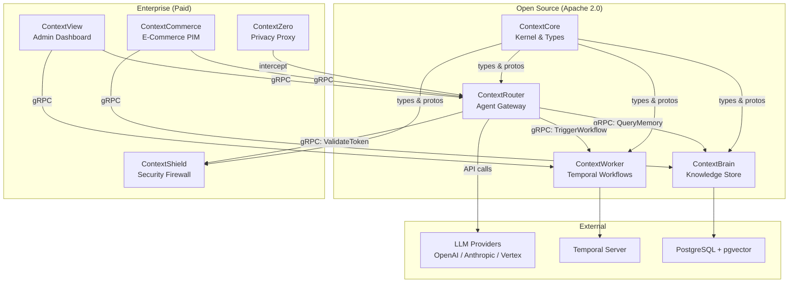
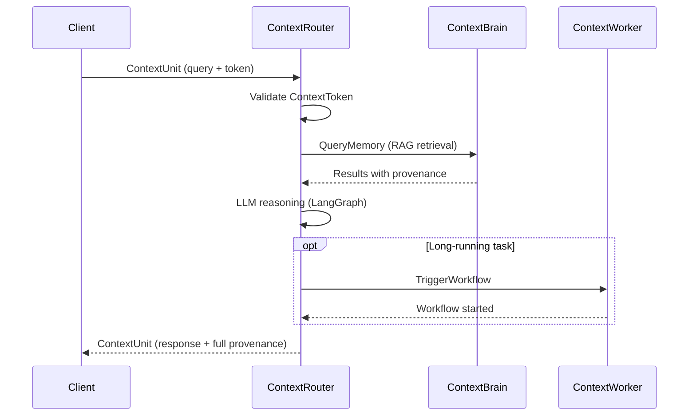

ContextUnity is a **service mesh** of modular Python services communicating over **gRPC**. Each service has a single responsibility and shares types through `ContextCore`.

## Ecosystem Map

## Communication Pattern

All inter-service communication uses the **ContextUnit** protocol. Every RPC call carries a typed Pydantic envelope with:
- **Payload** — domain-specific data (`google.protobuf.Struct`)
- **Provenance** — ordered trace of processing stages
- **Security** — scopes for access control
- **Tracing** — `trace_id` and `parent_unit_id` for distributed observability

## Service Roles

| Service | Role | Protocol | License |
|---------|------|----------|---------|
| **ContextCore** | Shared kernel — types, protos, tokens, config | dependency | Apache 2.0 |
| **ContextRouter** | Agent orchestration — LangGraph, tool dispatch | gRPC server | Apache 2.0 |
| **ContextBrain** | Knowledge — vectors, memory, taxonomy, RAG | gRPC server | Apache 2.0 |
| **ContextWorker** | Workflows — Temporal, schedules, agents | gRPC server | Apache 2.0 |
| **ContextShield** | Security — token signing, prompt filtering | gRPC server | Commercial |
| **ContextZero** | Privacy — PII masking, persona engine | middleware | Commercial |
| **ContextCommerce** | E-commerce — PIM, product matching, enrichment | Django app | Commercial |
| **ContextView** | Observability — dashboard, traces, admin | Django app | Commercial |

## Technology Stack

- **Language:** Python 3.13+
- **Inter-service:** gRPC with Protocol Buffers
- **Agent Framework:** LangGraph (LangChain)
- **Database:** PostgreSQL 16+ with pgvector and ltree extensions
- **Task Engine:** Temporal.io
- **LLM Providers:** OpenAI, Anthropic Claude, Google Vertex AI, Groq, Perplexity
- **Package Management:** uv
- **Configuration:** Pydantic BaseModel with `load_shared_config_from_env()`
