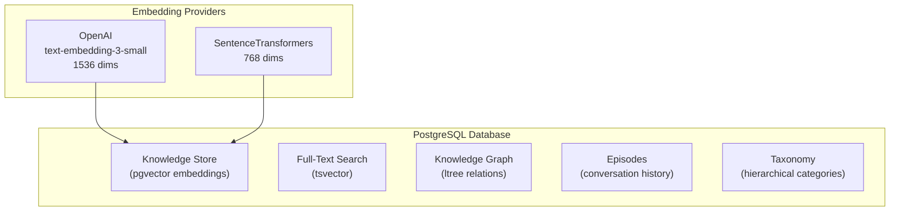

ContextBrain's knowledge store uses PostgreSQL with pgvector for dense vector embeddings and full-text search for keyword matching.

## Storage Architecture



## Mixin-Based Store

The storage layer uses a **mixin pattern** for modularity:

```python
class PostgresKnowledgeStore(
    BaseStore,         # Connection pool management
    SearchMixin,       # Vector + full-text search
    GraphMixin,        # Knowledge graph CRUD
    EpisodeMixin,      # Episodic memory management
    TaxonomyMixin,     # Taxonomy operations
):
    pass
```

## Upserting Knowledge

```python
from contextcore import ContextUnit, brain_pb2_grpc, context_unit_pb2

stub = brain_pb2_grpc.BrainServiceStub(channel)

# Store knowledge — domain data goes in payload
unit = ContextUnit(
    payload={
        "tenant_id": "my_project",
        "content": "PostgreSQL is a relational database...",
        "source_type": "document",
        "metadata": {"source": "docs", "page": 42},
    },
    provenance=["client:upsert"],
)
response_pb = stub.Upsert(unit.to_protobuf(context_unit_pb2))
```

## Querying

```python
unit = ContextUnit(
    payload={
        "tenant_id": "my_project",
        "query": "How does PostgreSQL handle concurrency?",
        "top_k": 10,
    },
)

# QueryMemory returns a stream of ContextUnit
for result_pb in stub.QueryMemory(unit.to_protobuf(context_unit_pb2)):
    result = ContextUnit.from_protobuf(result_pb)
    print(result.payload)
```

## Embedding Providers

| Provider | Model | Dimensions | Speed |
|----------|-------|------------|-------|
| **OpenAI** | `text-embedding-3-small` | 1536 | Fast (API) |
| **OpenAI** | `text-embedding-3-large` | 3072 | Fast (API) |
| **Local** | SentenceTransformers | 768 | No API needed |

:::caution
Database schema dimensions must match your embedder. After changing providers, run `uv run alembic upgrade head`.
:::

## Multi-Tenant Isolation

Every store operation is scoped by `tenant_id` using PostgreSQL Row-Level Security:

```python
async with store.tenant_connection(tenant_id) as conn:
    # All queries automatically filtered by tenant
    results = await conn.search(query_embedding, limit=10)
```

The `tenant_connection()` context manager:
- Sets `app.current_tenant` on every connection from the pool
- Fails closed — empty `tenant_id` raises `ValueError`
- Enforced at the database level via RLS policies
