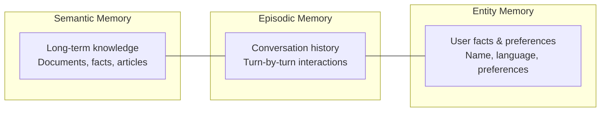
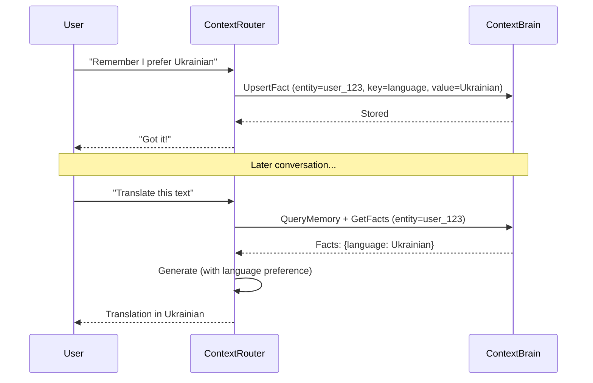

ContextBrain provides three types of memory for AI agents:

## Memory Types



### Semantic Memory
Long-term knowledge stored as vector embeddings. This is the main knowledge store — documents, articles, product descriptions, etc. Queried via `QueryMemory`.

### Episodic Memory
Conversation history. Each turn is stored as an episode linked to a session:

```python
from contextcore import ContextUnit, context_unit_pb2

# Add a conversation turn
unit = ContextUnit(payload={
    "tenant_id": "my_project",
    "session_id": "conv_abc123",
    "role": "user",
    "content": "What is RAG?",
})
stub.AddEpisode(unit.to_protobuf(context_unit_pb2))

unit = ContextUnit(payload={
    "tenant_id": "my_project",
    "session_id": "conv_abc123",
    "role": "assistant",
    "content": "RAG stands for Retrieval-Augmented Generation...",
})
stub.AddEpisode(unit.to_protobuf(context_unit_pb2))
```

Episodic memory is scoped by `session_id` and `tenant_id`, enabling agents to recall previous conversation context.

### Entity Memory
Persistent facts about entities (users, organizations, preferences):

```python
# Store a user preference
unit = ContextUnit(payload={
    "tenant_id": "my_project",
    "entity_id": "user_123",
    "fact_type": "preference",
    "key": "language",
    "value": "Ukrainian",
})
stub.UpsertFact(unit.to_protobuf(context_unit_pb2))
```

Entity facts persist across sessions and are automatically injected into agent context when relevant.

## Memory in the Agent Loop


