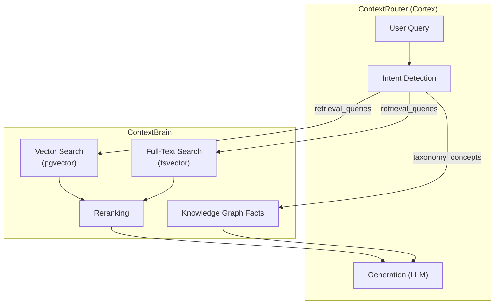

ContextBrain provides the retrieval backend for RAG. ContextRouter's [Cortex Pipeline](/router/cortex/) orchestrates the full RAG flow, while Brain handles the storage and search.

## RAG Architecture



## Hybrid Search

Brain combines two search strategies:

### 1. Vector Similarity (Dense)
Semantic search using pgvector cosine similarity:
```sql
SELECT content, embedding <=> query_embedding AS distance
FROM knowledge
WHERE tenant_id = $1
ORDER BY embedding <=> query_embedding
LIMIT $2;
```

### 2. Full-Text Search (Sparse)
Keyword matching using PostgreSQL tsvector:
```sql
SELECT content, ts_rank(search_vector, plainto_tsquery($1)) AS rank
FROM knowledge
WHERE search_vector @@ plainto_tsquery($1)
ORDER BY rank DESC;
```

Results from both paths are merged and reranked.

## Ingestion

The ingestion pipeline in `contextbrain/ingestion/rag/` handles:

1. **Document processing** — split, chunk, clean
2. **Embedding generation** — via configured embedder (OpenAI or local)
3. **Storage** — vector + metadata into PostgreSQL
4. **Taxonomy classification** — automatic category assignment

## News Engine

Brain also supports a specialised news engine:

```python
from contextcore import ContextUnit, context_unit_pb2

# Store news fact
unit = ContextUnit(payload={
    "tenant_id": "my_project",
    "title": "AI Breakthrough",
    "content": "Researchers achieved...",
    "category": "technology",
    "source_url": "https://...",
})
stub.UpsertNewsItem(unit.to_protobuf(context_unit_pb2))

# Retrieve news (streaming)
unit = ContextUnit(payload={
    "tenant_id": "my_project",
    "category": "technology",
    "limit": 10,
})
for item_pb in stub.GetNewsItems(unit.to_protobuf(context_unit_pb2)):
    item = ContextUnit.from_protobuf(item_pb)
    print(item.payload)
```
