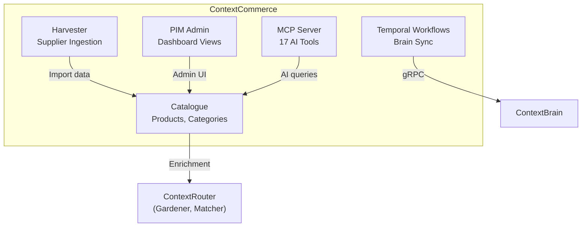

import { Card, CardGrid } from '@astrojs/starlight/components';

:::caution[Enterprise Service]
ContextCommerce is a commercial service requiring a license. It builds upon the open-source ContextUnity foundation.
:::

ContextCommerce provides the commerce domain for ContextUnity — a Django/Oscar-based Product Information Management (PIM) platform with AI-powered enrichment, matching, and taxonomy.

<CardGrid>
  <Card title="Catalog & PIM" icon="document">
    Django/Oscar product CRUD with admin UI, variant management, and editorial workflows.
  </Card>
  <Card title="Harvester Pipelines" icon="setting">
    Pluggable supplier data ingestion — fetchers (HTTP, file) and transformers (XLSX, CSV, XML, JSON).
  </Card>
  <Card title="AI Enrichment" icon="rocket">
    Product descriptions, taxonomy classification, and semantic matching via ContextRouter agents.
  </Card>
  <Card title="MCP Server" icon="puzzle">
    17 FastMCP tools for AI-driven product search, matching, enrichment, and supplier operations.
  </Card>
</CardGrid>

## Architecture

## Key Modules

### Catalogue (`catalogue/`)
Oscar-based product domain:
- Product, Category, ProductAttribute models
- Rich admin with inline editors
- Full-text + pgvector search

### Harvester (`harvester/`)
Supplier data import pipeline:
- **Fetchers** — HTTP, file-based data sources
- **Transformers** — XLSX, CSV, XML, JSON format parsers
- **Registry** — pluggable fetcher + transformer registration
- **Skills** — AI-powered harvester capabilities

### MCP Server (`mcp/`)
17 FastMCP tools organized by domain:

| Category | Tools |
|----------|-------|
| **Products** | `search_products`, `get_product`, `update_product`, `update_product_price`, `get_catalog_stats` |
| **Suppliers** | `search_dealer_products`, `get_dealer_product`, `list_dealers`, `list_unmatched_products` |
| **Matching** | `find_match_candidates`, `link_products`, `unlink_product`, `bulk_link_products` |
| **Enrichment** | `get_enrichment_status`, `list_enrichment_queue`, `enrich_product_description`, `get_taxonomy_tree` |

### Temporal Workflows (`temporal/`)
Brain synchronization:
- `SyncProductToBrainWorkflow` — sync canonical products
- `SyncDealerProductToBrainWorkflow` — sync supplier products
- Activities: `fetch_product`, `generate_embedding`, `upsert_to_brain`
