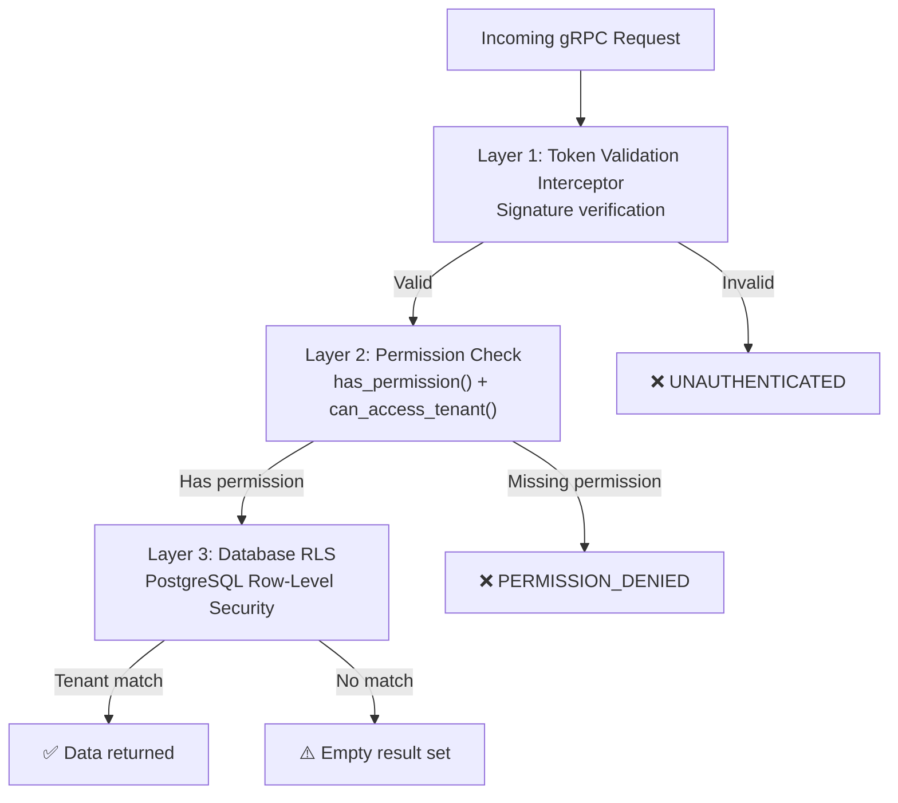

**ContextToken** is the authorization mechanism for the entire ContextUnity ecosystem. It implements a **capability-based** security model where each token carries specific permissions, tenant scoping, and identity information.

## Token Structure

`ContextToken` is a frozen dataclass:

```python
from contextcore.tokens import ContextToken

@dataclass(frozen=True)
class ContextToken:
    token_id: str                          # Unique identifier for audit trails
    permissions: tuple[str, ...] = ()      # Capabilities (e.g., "catalog:read")
    allowed_tenants: tuple[str, ...] = ()  # Tenant IDs (empty = admin/all)
    exp_unix: float | None = None          # Expiration timestamp
    revocation_id: str | None = None       # For instant revocation
    user_id: str | None = None             # Human user identity
    agent_id: str | None = None            # Executing agent identity
    user_namespace: str = "default"        # Access tier: free, pro, admin, system
```

## Creating Tokens

Tokens are created via `TokenBuilder.mint_root()`:

```python
from contextcore.tokens import TokenBuilder

builder = TokenBuilder(enabled=True, private_key_path="/path/to/key")

token = builder.mint_root(
    user_ctx={},
    permissions=["brain:read", "brain:write", "router:dispatch"],
    ttl_s=3600,
    allowed_tenants=["my_project"],
    user_id="user_123",
    agent_id="rag-agent",
    user_namespace="pro",
)
```

## Token Validation

```python
# Check specific permission
token.has_permission("brain:read")  # True

# Check tenant access
token.can_access_tenant("my_project")  # True
token.can_access_tenant("other")       # False

# Check expiration
token.is_expired()  # False (if TTL hasn't elapsed)

# Check against ContextUnit security scopes
token.can_read(unit.security)   # Checks read scopes
token.can_write(unit.security)  # Checks write scopes
```

## Token Attenuation (Delegation)

Child tokens can only have **fewer** permissions than the parent:

```python
child_token = builder.attenuate(
    token,
    permissions=["brain:read"],    # Subset of parent's permissions
    ttl_s=600,                     # Shorter TTL
    agent_id="tool-agent",         # New agent identity
)
# user_id, user_namespace, allowed_tenants are inherited and CANNOT be expanded
```

## Permission Model

Permissions follow the `service:action` or `domain:action` format:

| Permission | Description |
|-----------|-------------|
| `brain:read` | Query knowledge, memory, taxonomy |
| `brain:write` | Upsert knowledge, add episodes |
| `catalog:read` | Read product catalog |
| `product:write` | Modify product data |
| `router:dispatch` | Send requests to Router |
| `data:read` | Default read permission |
| `data:write` | Default write permission |

## Three-Layer Security Model

ContextUnity enforces security at three independent layers:



### Layer 1 — Token Validation Interceptor
Every gRPC call must include a valid token in metadata. The interceptor:
- Extracts the token from gRPC metadata
- Verifies the cryptographic signature (Ed25519 or KMS via ContextShield)
- Checks `is_expired()`
- Rejects unsigned/expired/malformed tokens

### Layer 2 — Permission Check
Each service validates permissions per RPC method:
- `has_permission("brain:read")` for `QueryMemory`
- `can_access_tenant(tenant_id)` for tenant scoping
- `can_read(unit.security)` / `can_write(unit.security)` for ContextUnit access

### Layer 3 — Database Row-Level Security
PostgreSQL RLS ensures data isolation even if application logic is bypassed.

## Multi-Tenant Isolation

```python
# Token scoped to specific tenants
token = builder.mint_root(
    user_ctx={},
    permissions=["brain:read"],
    ttl_s=3600,
    allowed_tenants=["project_alpha", "project_beta"],
)

token.can_access_tenant("project_alpha")  # ✅ True
token.can_access_tenant("project_gamma")  # ❌ False

# Admin token (empty allowed_tenants = access all)
admin_token = builder.mint_root(
    user_ctx={},
    permissions=["brain:read"],
    ttl_s=3600,
    allowed_tenants=[],  # Admin — unrestricted
)
admin_token.can_access_tenant("any_tenant")  # ✅ True
```

## Signing Backends

| Backend | Use Case | Configuration |
|---------|----------|---------------|
| **Ed25519** | Production, self-hosted | `SIGNING_BACKEND=ed25519`, key file paths |
| **Cloud KMS** | Enterprise (via ContextShield) | `SIGNING_BACKEND=kms`, `KMS_KEY_RESOURCE` |
| **Disabled** | Testing only | `SECURITY_ENABLED=false` |

:::caution
When `SECURITY_ENABLED=false`, all access checks are bypassed. Never use this in production.
:::
