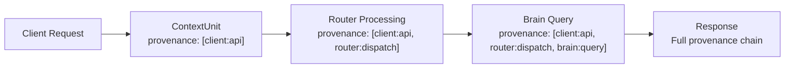

**ContextUnit** is the atomic data contract for all interactions across the ContextUnity ecosystem. Every gRPC call — whether Router querying Brain, Worker triggering a workflow, or an external client connecting — uses `ContextUnit` as its transport envelope.

## Protocol Buffer Definition

```protobuf
message ContextUnit {
    string unit_id = 1;                        // UUIDv4 (auto-generated)
    string trace_id = 2;                       // Cross-service trace ID
    string parent_unit_id = 3;                 // Optional parent reference
    Modality modality = 4;                     // text / audio / spatial / image
    google.protobuf.Struct payload = 5;        // Domain-specific data
    repeated string provenance = 6;            // Data journey labels
    repeated CotStep chain_of_thought = 7;     // Reasoning steps
    UnitMetrics metrics = 8;                   // Performance telemetry
    SecurityScopes security = 9;               // Access control scopes
    google.protobuf.Timestamp created_at = 10; // Creation timestamp
}
```

## Data Flow



Every service that touches the data **extends the provenance** — never replaces it. This creates a complete audit trail across the entire system.

## Python SDK Usage

Always use the Pydantic wrapper, never raw Protobuf constructors:

```python
from contextcore import ContextUnit, context_unit_pb2

# ✅ Correct — Pydantic model with type safety
unit = ContextUnit(
    payload={"query": "What is RAG?", "top_k": 5},
    provenance=["client:search"],
)

# Serialize for gRPC transport
proto = unit.to_protobuf(context_unit_pb2)

# Deserialize from gRPC response
unit = ContextUnit.from_protobuf(response_proto)
```

:::danger[Never use raw Protobuf]
```python
# ❌ Forbidden — bypasses validation, fails CI conformance checks
unit = context_unit_pb2.ContextUnit()
unit.payload.update({"status": "success"})
```
:::

## Provenance Rules

Provenance is an ordered list of labels showing where data has traveled. Format: `service:action` or `service:subsystem:action`.

```python
# When creating a new unit from a parent
response = ContextUnit(
    payload=result_data,
    parent_unit_id=incoming_unit.unit_id,
    trace_id=incoming_unit.trace_id,
    provenance=list(incoming_unit.provenance) + ["myservice:process"],
)
```

### Common Provenance Labels

| Label | Meaning |
|-------|---------|
| `client:api` | External API client |
| `router:dispatch` | Router dispatcher processed |
| `brain:query` | Brain vector search |
| `brain:upsert` | Brain knowledge storage |
| `worker:harvest` | Worker harvesting workflow |
| `commerce:enrich` | Commerce enrichment |
| `zero:anonymize` | ContextZero PII masking |

## Error Handling

Even in error paths, ContextUnit must carry a valid payload:

```python
try:
    result = await process(unit)
except Exception as e:
    return ContextUnit(
        payload={"error": str(e), "code": "PROCESSING_FAILED"},
        provenance=list(unit.provenance) + ["service:error"],
        parent_unit_id=unit.unit_id,
        trace_id=unit.trace_id,
    )
```

## Conformance

As of February 2026, all services enforce **100% ContextUnit conformance**. The `test_contextunit_conformance.py` scanner in integration tests checks:

- No raw `context_unit_pb2.ContextUnit()` constructors
- Every `ContextUnit()` has a `provenance` argument
- All mutated responses extend (not replace) provenance
- Error responses carry structured `payload`
