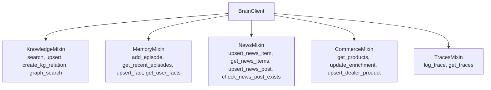

`BrainClient` is the recommended way to interact with ContextBrain from Python. It provides a typed, mixin-based API that works in both **gRPC mode** (production) and **local mode** (development).

## Quick Start

```python
from contextcore import BrainClient

# gRPC mode (connects to running Brain service)
client = BrainClient(host="localhost:50051")

# Search
results = await client.search(
    tenant_id="my_project",
    query_text="How does RAG work?",
    limit=5,
    source_types=["document", "article"],
)
for r in results:
    print(f"Score: {r.score}, Content: {r.content}")
```

## Mixin Architecture

BrainClient is composed of mixins, each providing a domain of operations:



## Knowledge Operations

```python
# Search
results = await client.search(
    tenant_id="my_project",
    query_text="How does PostgreSQL handle concurrency?",
    limit=10,
    source_types=["document"],
)

# Upsert
await client.upsert(
    tenant_id="my_project",
    content="PostgreSQL uses MVCC for concurrency...",
    source_type="document",
    metadata={"source": "docs", "page": 42},
    doc_id="doc_123",  # optional, for updates
)

# Knowledge Graph relation
await client.create_kg_relation(
    tenant_id="my_project",
    source_type="concept",
    source_id="PostgreSQL",
    relation="USES",
    target_type="concept",
    target_id="MVCC",
)

# Graph traversal
graph_result = await client.graph_search(
    tenant_id="my_project",
    entrypoint_ids=["PostgreSQL"],
    max_hops=2,
    allowed_relations=["USES", "REQUIRES"],
    max_results=200,
)
```

## Memory Operations

```python
# Add episode
await client.add_episode(
    tenant_id="my_project",
    session_id="conv_abc123",
    role="user",
    content="What is RAG?",
)

# Get recent episodes
episodes = await client.get_recent_episodes(
    tenant_id="my_project",
    session_id="conv_abc123",
    limit=20,
)

# Upsert entity fact
await client.upsert_fact(
    tenant_id="my_project",
    entity_id="user_123",
    fact_type="preference",
    key="language",
    value="Ukrainian",
)

# Get user facts
facts = await client.get_user_facts(
    tenant_id="my_project",
    entity_id="user_123",
)
```

## Dual Mode

Every method supports both gRPC and local modes:

| Mode | When | How |
|------|------|-----|
| **gRPC** | Production, multi-service | `BrainClient(host="brain:50051")` |
| **Local** | Development, testing | `BrainClient(local_store=my_store)` |

In local mode, calls go directly to the storage layer without network overhead.
