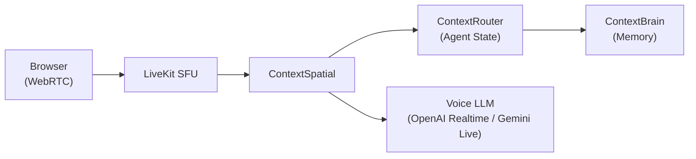

:::note[Roadmap]
ContextSpatial is in the architectural design phase and not yet available for use.
:::

ContextSpatial will expand the ContextUnity agent pipeline into the **voice domain**, providing real-time audio interactions through WebRTC and native voice LLM APIs.

## Planned Features

### LiveKit Telephony
Use [LiveKit](https://livekit.io/) as a Session Forwarding Unit (SFU) to stream browser/mobile microphone audio directly to active agent sessions without polling overhead.

### Native Voice LLMs
Direct binding to OpenAI Realtime API and Gemini Live Bidi-streams — bypassing the traditional STT → LLM → TTS stack for significantly lower latency.

### Semantic Interrupts
Voice agents maintain active conversational state with ContextRouter. During a voice session, the agent can fire tool operations — looking up memory from ContextBrain or executing database queries — mid-conversation.

### Google ADK Bidi-streaming
Native support for Gemini Live API with multimodal data ingestion over WebSocket.

## Architecture Concept

