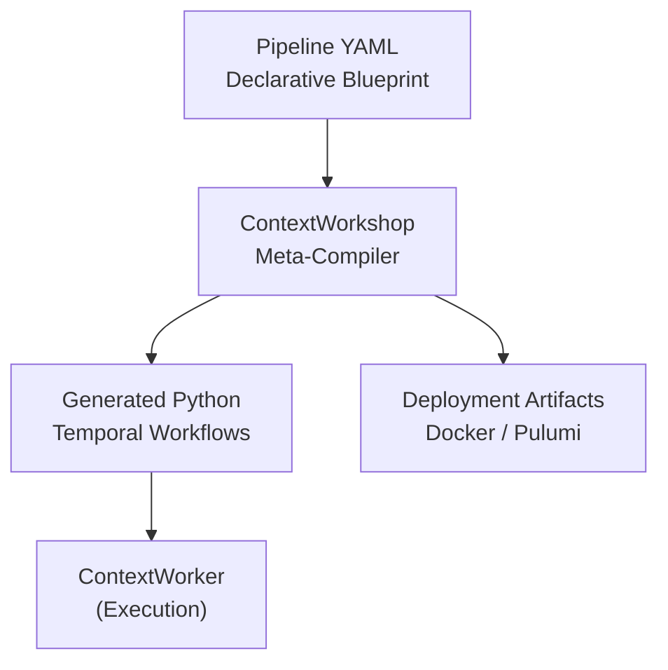

:::note[Roadmap]
ContextWorkshop is in the planning and architectural design phase.
:::

ContextWorkshop will automate the creation of AI pipelines by compiling declarative YAML blueprints into durable Temporal workflow code.

## Planned Features

### Pipeline DSL
Introduction of `workshop/v1` pipeline schemas specifying `source`, `transform`, and `agent` stages declaratively.

### Visual-to-Code Compilation
Transform UI-generated YAML blueprints into isolated Temporal workflow code files. Input (IMAP, webhook) and output (vector store, Postgres) stages compiled automatically.

### AI-Driven Graph Generation
Embed LangGraph code generators within the compiler to synthesize custom retrieval or classification logic dynamically based on the pipeline description.

### Infrastructure Automation
Direct deployment output — standalone artifacts ready for `docker compose` or Pulumi deployment to separate hosting zones.

### DevTools MCP
Model Context Protocol server for technical documentation ingestion into ContextBrain, staleness measurement, and autonomous linter/formatter triggers.

## Architecture Concept

