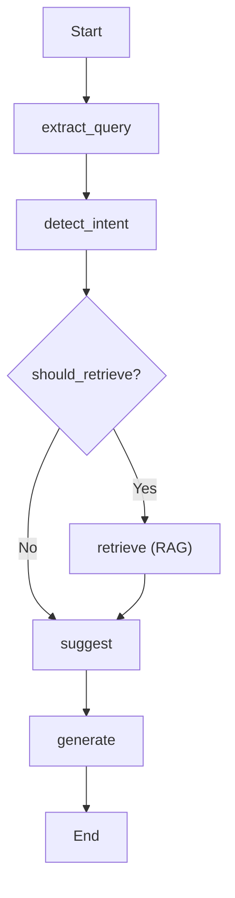

ContextRouter uses [LangGraph](https://github.com/langchain-ai/langgraph) for agent orchestration. Each agent is a state machine that processes requests through a series of nodes with conditional routing.

## Model Registry

All LLM usage goes through the central registry with automatic fallback:

```python
from contextrouter.modules.models import model_registry

model = model_registry.get_llm_with_fallback(
    key="openai/gpt-5-mini",
    fallback_keys=["anthropic/claude-sonnet-4", "vertex/gemini-2.5-flash"],
    strategy="fallback",
    config=config,
)

response = await model.generate(request)
```

### Supported Providers

| Provider | Models | Backend |
|----------|--------|---------|
| **OpenAI** | GPT-5, GPT-5-mini, o1, o3 | `openai.py` |
| **Anthropic** | Claude Sonnet 4, Haiku | `anthropic.py` |
| **Vertex AI** | Gemini 2.5 Flash/Pro | `vertex.py` |
| **Groq** | Llama (ultra-fast inference) | `groq.py` |
| **Perplexity** | Sonar (web-grounded) | `perplexity.py` |
| **RLM** | Recursive Language Model | `rlm.py` |
| **HuggingFace** | HF Inference / Hub | `huggingface.py` |
| **OpenRouter** | Multi-provider gateway | `openrouter.py` |
| **LiteLLM** | Universal adapter | `litellm.py` |
| **Local** | Ollama, vLLM (OpenAI-compat) | `local_openai.py` |
| **RunPod** | Serverless inference | `runpod.py` |

## Agent Graphs

Agent graphs are defined in `cortex/graphs/` as LangGraph `StateGraph` instances:



### Built-in Graphs

| Graph | Purpose | Location |
|-------|---------|----------|
| **Dispatcher** | Central request routing | `graphs/dispatcher.py` |
| **RAG Retrieval** | Knowledge retrieval pipeline | `graphs/rag_retrieval/` |
| **Gardener** | Product taxonomy classification | `graphs/commerce/gardener/` |
| **Matcher** | Product linking (RLM-based) | `graphs/commerce/matcher/` |
| **News Engine** | Multi-stage news pipeline | `graphs/news_engine/` |
| **Analytics** | Data analytics pipeline | `graphs/analytics/` |
| **Self-healing** | Auto-recovery logic | `graphs/self_healing/` |

## Plugin Architecture

Router supports a plugin system for extending functionality:

```python
from contextrouter.core.plugins import PluginManager

# Plugins register connectors, transformers, providers
plugin_manager = PluginManager()
plugin_manager.discover_plugins()
```

Plugins can register:
- **Connectors** — new data sources
- **Transformers** — new processing stages (NER, classification, etc.)
- **Providers** — new storage backends
- **Tools** — new LLM function calling tools
