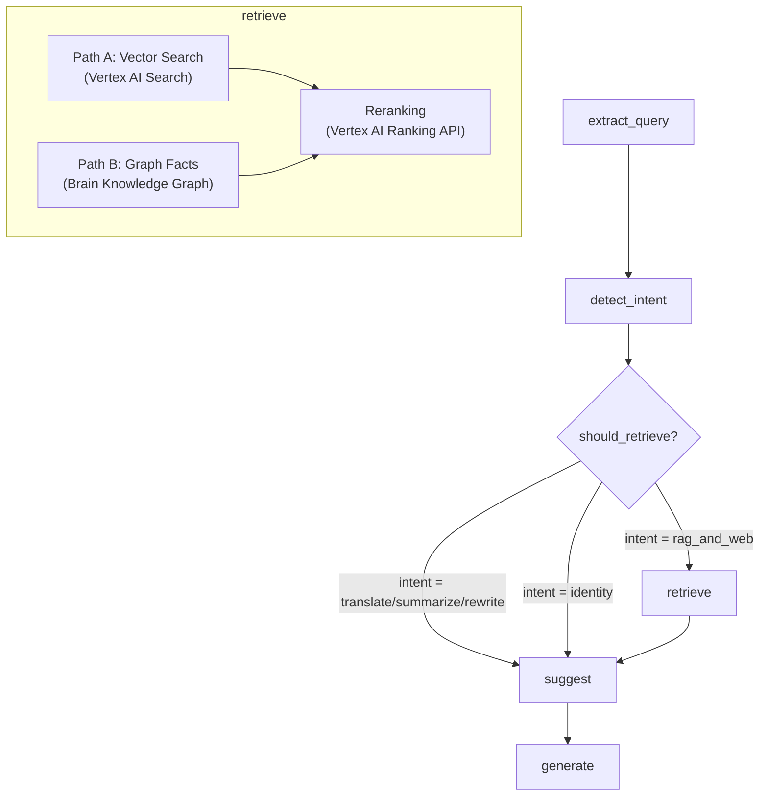

The **Cortex** is the shared LangGraph pipeline used by all Router agents. It processes user messages through a series of graph nodes, optionally retrieves context from Brain, and generates responses.

## Pipeline Flow



## Nodes

### `extract_query`
Reads the latest `HumanMessage` from state, sets `user_query`, `should_retrieve`, and initializes defaults.

### `detect_intent`
Uses a fast LLM (e.g., `gemini-2.0-flash-lite`) to classify the user's intent:

| Intent | Description | Uses RAG? |
|--------|-------------|-----------|
| `rag_and_web` | Questions requiring knowledge retrieval | ✅ |
| `translate` | Translation requests | ❌ |
| `summarize` | Summarization requests | ❌ |
| `rewrite` | Rewriting/editing | ❌ |
| `identity` | Questions about the assistant itself | ❌ |

Also performs **taxonomy enrichment** — matches user query against the taxonomy `canonical_map` to detect concepts and strengthen retrieval queries.

### `retrieve`
Dual-path retrieval:

**Path A — Vector Search:**
- Searches Vertex AI Search datastores (books, videos, QA, web)
- Runs web search for allowed domains via Google CSE
- Reranks results per source type using Vertex AI Ranking API

**Path B — Graph Facts:**
- Fetches relationship facts from Brain Knowledge Graph
- Filters by `runtime_fact_labels` from ontology configuration
- Adds as non-citation background knowledge to the RAG prompt

### `suggest`
Generates optional search suggestions for `rag_and_web` intent.

### `generate`
Produces the final assistant response. If retrieval yielded zero documents, generates a no-results message.

## Debugging

Enable pipeline debug logging:

```bash
export DEBUG_PIPELINE=1    # Per-node structured logs
export DEBUG_WEB_SEARCH=1  # Raw CSE result previews
```

Output format:
```
PIPELINE extract_query | user_query="How does RAG work?"
PIPELINE detect_intent.out | intent=rag_and_web taxonomy_concepts=["RAG"]
PIPELINE retrieve.out | docs=5 books=3 videos=1 qa=1 web=0
PIPELINE generate.out | assistant_chars=450 web_sources=0
```
