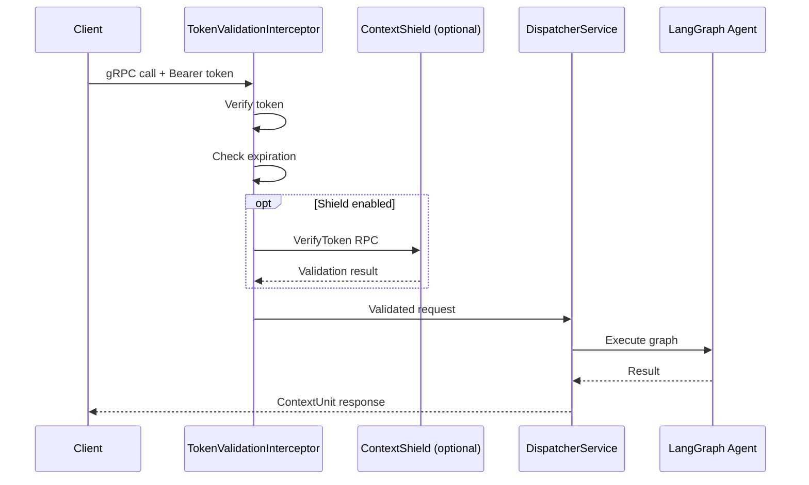

The Dispatcher is ContextRouter's gRPC service layer — it receives incoming requests, validates tokens, and routes them to the appropriate LangGraph agent.

## gRPC Service

```protobuf
service RouterService {
    rpc ExecuteAgent(ContextUnit) returns (ContextUnit);
    rpc StreamAgent(ContextUnit) returns (stream ContextUnit);
    rpc ExecuteDispatcher(ContextUnit) returns (ContextUnit);
    rpc StreamDispatcher(ContextUnit) returns (stream ContextUnit);
    rpc RegisterTools(ContextUnit) returns (ContextUnit);
    rpc DeregisterTools(ContextUnit) returns (ContextUnit);
    rpc ToolExecutorStream(stream ContextUnit) returns (stream ContextUnit);
}
```

### ExecuteAgent / StreamAgent
Execute a specific agent graph by name. `StreamAgent` returns intermediate reasoning steps as they happen.

### ExecuteDispatcher / StreamDispatcher
Dispatch to the central dispatcher graph, which selects the appropriate agent based on intent. `StreamDispatcher` provides streaming output.

### RegisterTools / DeregisterTools
Register and deregister external tools for LLM function calling.

### ToolExecutorStream
Bi-directional streaming for external tool execution. External projects connect to Router via persistent bidi-streams, allowing the agent to invoke tools on the client side (e.g., SQL queries on a local database) without exposing credentials.

## Security Flow



## Token Validation

Every gRPC call passes through the interceptor chain (`service/interceptors.py`):

1. Extract `authorization` header from metadata
2. Verify token (Ed25519 signature or Shield delegation)
3. Check `is_expired()`
4. Validate `can_access_tenant(tenant_id)`
5. Inject validated token into the request context

## Shield Client Integration

When ContextShield is configured, Router delegates security checks via `service/shield_client.py`:

```python
from contextrouter.service.shield_client import ShieldClient

shield = ShieldClient(host="localhost:50054")

# Verify token
result = await shield.verify_token(token)

# Scan input for prompt injection
scan_result = await shield.scan(user_input)
if scan_result.blocked:
    raise SecurityError(f"Blocked: {scan_result.reason}")
```
