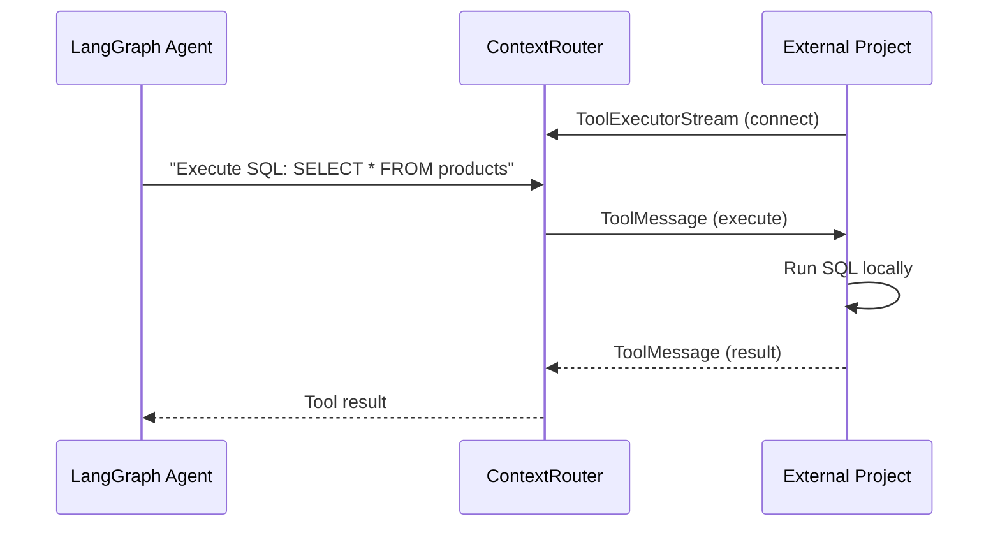

ContextRouter exposes tools for LLM function calling. Tools allow agents to interact with Brain (search), Commerce (products), databases, and external services.

## Built-in Tools

| Tool | Module | Description |
|------|--------|-------------|
| Brain Search | `modules/tools/` | Query Brain knowledge store |
| Commerce Products | `modules/tools/` | Search/update product catalog |
| Web Connector | `modules/connectors/web.py` | Web search via Google CSE |
| RSS Connector | `modules/connectors/rss.py` | RSS feed ingestion |
| File Connector | `modules/connectors/file.py` | Local file reading |
| API Connector | `modules/connectors/api.py` | Generic HTTP API calls |

## ToolExecutorStream

The `ToolExecutorStream` RPC enables **bi-directional tool execution**. External projects connect to Router via persistent gRPC bidi-streams, allowing agents to invoke tools on the client side without exposing credentials.



### Client-Side Implementation

```python
from contextcore import ContextUnit, create_channel_sync, context_unit_pb2
from contextcore import router_pb2_grpc

async def tool_executor():
    channel = create_channel_sync("router:50052")
    stub = router_pb2_grpc.RouterServiceStub(channel)

    async for message_pb in stub.ToolExecutorStream(request_stream()):
        message = ContextUnit.from_protobuf(message_pb)
        # Execute tool locally
        tool_name = message.payload.get("tool_name")
        if tool_name == "sql_query":
            result = await run_sql(message.payload["arguments"]["query"])
            response = ContextUnit(
                payload={"result": result, "tool_call_id": message.payload["tool_call_id"]},
            )
            yield response.to_protobuf(context_unit_pb2)
```

## Tool Registration

Tools are registered via the `ToolFactory`:

```python
from contextrouter.service.tool_factory import ToolFactory

factory = ToolFactory(config)
tools = factory.build_tools(agent_config)
```

The factory reads agent configuration to determine which tools are available for each agent, enforcing the principle of least privilege.
