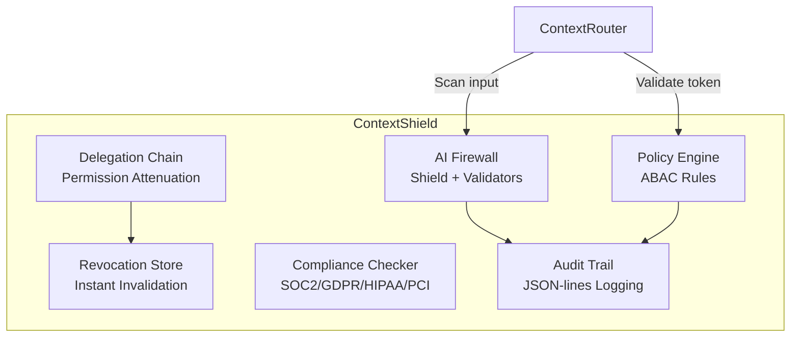

import { Card, CardGrid } from '@astrojs/starlight/components';

:::caution[Enterprise Service]
ContextShield is a commercial service requiring a license. It builds upon the open-source ContextUnity foundation.
:::

ContextShield is the **security perimeter** of ContextUnity. It provides declarative security through prompt injection detection, policy-based authorization, compliance auditing, and cryptographic token management.

<CardGrid>
  <Card title="AI Firewall" icon="warning">
    Prompt injection, jailbreak, and PII leak detection with configurable YAML rule sets.
  </Card>
  <Card title="Policy Engine" icon="approve-check">
    Declarative ABAC policies with ContextToken integration for fine-grained access control.
  </Card>
  <Card title="Compliance" icon="document">
    SOC 2, GDPR, HIPAA, and PCI DSS posture validation and audit trails.
  </Card>
  <Card title="Delegation Chains" icon="random">
    Cryptographic permission attenuation for multi-hop agent architectures.
  </Card>
</CardGrid>

## Architecture



## Key Components

### AI Firewall (`firewall/`)
The `Shield` orchestrates multiple validators:
- **InjectionValidator** — detects prompt injection attempts
- **JailbreakValidator** — detects jailbreak patterns
- **PIIValidator** — detects PII (names, phones, IDs) via regex + Presidio ML
- **RAGContextValidator** — validates retrieval context integrity

PII detection rules are loaded from `firewall/rules/pii.yaml` — no redeployment needed to add new rules.

### Policy Engine (`policy.py`)
Declarative attribute-based access control:

```python
from contextshield import PolicyEngine, Policy

engine = PolicyEngine()
engine.add_policy(Policy(
    name="brain_read",
    conditions={"permission": "brain:read", "tenant": "my_project"},
    effect="allow",
))

result = engine.evaluate(token, resource="brain", action="read")
```

### Delegation Chains (`delegation.py`)
Cryptographic permission attenuation for multi-hop calls:

```python
from contextshield.delegation import DelegationChain

# Parent delegates subset of permissions to child
chain = DelegationChain(parent_token)
child_token = chain.attenuate(
    permissions=("brain:read",),  # Subset of parent's permissions
    ttl_seconds=3600,
)
```

## gRPC Service (14 RPCs)

| RPC | Description |
|-----|-------------|
| `Scan` | AI firewall scan (injection/PII detection) |
| `EvaluatePolicy` | Policy engine evaluation |
| `CheckCompliance` | Compliance posture check |
| `RecordAudit` | Record audit event |
| `MintToken` | Create signed ContextToken |
| `VerifyToken` | Verify token signature and validity |
| `RevokeToken` | Add to revocation list |
| `GetStats` | Security metrics and statistics |
| `GetSecret` | Retrieve a secret |
| `PutSecret` | Store a secret |
| `ListSecrets` | List stored secrets |
| `RotateSecret` | Rotate a secret |
| `Encrypt` | Encrypt data |
| `Decrypt` | Decrypt data |

## CLI

```bash
# Key management
python -m contextshield keygen
python -m contextshield rotate

# Token operations
python -m contextshield mint --tenant my_project --permissions brain:read
python -m contextshield verify --token <token>

# Status
python -m contextshield status
```
