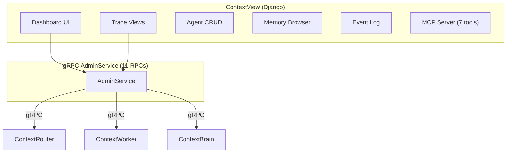

import { Card, CardGrid } from '@astrojs/starlight/components';

:::caution[Enterprise Service]
ContextView is a commercial service requiring a license. It builds upon the open-source ContextUnity foundation.
:::

ContextView is the **observability and admin hub** for ContextUnity — a Django-based dashboard providing trace inspection, agent management, memory browsing, and system analytics.

<CardGrid>
  <Card title="Trace Observability" icon="eye">
    Search and browse agent traces, step details, and Langfuse cross-referencing.
  </Card>
  <Card title="Agent Management" icon="setting">
    CRUD for agent configurations, permissions, tool policies, and hierarchy.
  </Card>
  <Card title="Memory Browser" icon="document">
    Inspect episodic and entity memory across tenants and sessions.
  </Card>
  <Card title="MCP Server" icon="puzzle">
    7 FastMCP tools for AI-driven admin queries and management.
  </Card>
</CardGrid>

## Architecture

## Dashboard Views

| View | URL | Description |
|------|-----|-------------|
| **Dashboard** | `/` | System overview with KPI charts |
| **Traces** | `/traces/` | Agent execution trace list |
| **Trace Detail** | `/traces/<id>/` | Step-by-step trace inspection |
| **Agents** | `/agents/` | Agent configuration list |
| **Agent Detail** | `/agents/<id>/` | Agent config and permissions |
| **Memory** | `/memory/` | Episodic and entity memory browser |
| **Events** | `/events/` | System event log |

## gRPC AdminService (11 RPCs)

Provides programmatic admin access for automation and external tools.

## MCP Server (7 Tools)

FastMCP tools for AI-driven admin queries — exposing agent management, trace search, and system analytics to LLM-powered workflows.

## Additional Capabilities

- **Healing & Analytics** — error pattern detection and automated service recovery
- **Langfuse Integration** — cross-references traces between ContextView and Langfuse for deep LLM debugging
- **Agent Hierarchy** — visual permission tree showing agent relationships and capability inheritance
