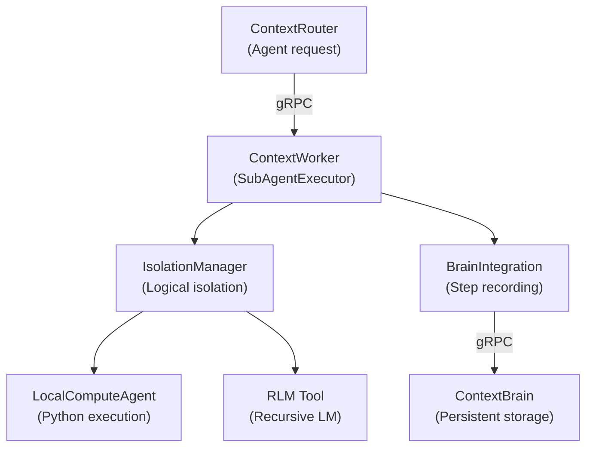

ContextWorker's sub-agent system provides logically isolated execution environments for agent-generated tasks.

## Architecture



## Components

### SubAgentExecutor
The orchestrator that coordinates execution, isolation, and recording:

```python
from contextworker.subagents.executor import SubAgentExecutor

executor = SubAgentExecutor(config)
result = await executor.execute(
    task="Generate product description",
    context={"product": product_data},
    agent_type="compute",
)
```

### IsolationManager
Provides logical isolation contexts for sub-agent tasks (strict Docker sandboxing is planned):

```python
from contextworker.subagents.isolation import IsolationManager

manager = IsolationManager()
async with manager.create_context() as ctx:
    # Execute within isolated context
    result = await ctx.run(code, timeout=30)
```

### BrainIntegration
Records each execution step to ContextBrain for observability:

```python
from contextworker.subagents.brain_integration import BrainIntegration

brain = BrainIntegration(brain_client)
await brain.record_step(
    session_id="exec_123",
    step="code_execution",
    result=result,
)
```

### LocalComputeAgent
Executes Python code in a sandboxed environment:

```python
from contextworker.subagents.local_compute import LocalComputeAgent

agent = LocalComputeAgent()
result = await agent.execute(
    code="import math; result = math.factorial(10)",
    timeout=30,
)
```

:::note
Docker-based sandboxing (network-disabled `python:3.13-slim` containers) is on the roadmap. Currently, isolation is logical only.
:::
