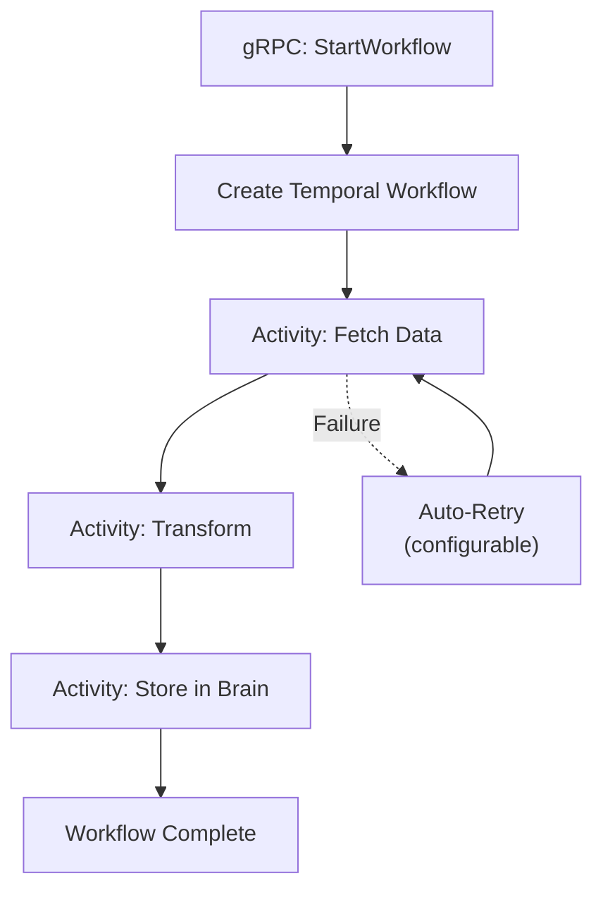

ContextWorker uses [Temporal.io](https://temporal.io/) for durable workflow execution. Workflows survive process restarts, network failures, and server crashes.

## Dual-Mode Operation

Worker runs in two modes:

### 1. gRPC Service (default)
```bash
python -m contextworker
```
Starts the gRPC `WorkerService` for receiving workflow triggers from other services.

### 2. Temporal Worker
```bash
# All discovered modules
python -m contextworker --temporal

# Specific modules only
python -m contextworker --temporal --modules harvest gardener
```
Starts Temporal workers that execute registered workflows and activities.

## gRPC Service

```protobuf
service WorkerService {
    rpc StartWorkflow(ContextUnit) returns (ContextUnit);
    rpc GetTaskStatus(ContextUnit) returns (ContextUnit);
    rpc ExecuteCode(ContextUnit) returns (ContextUnit);  // Planned
}
```

### StartWorkflow
Routes to appropriate Temporal workflow by `workflow_type`:

```python
from contextcore import ContextUnit

unit = ContextUnit(
    payload={
        "workflow_type": "harvest",
        "supplier_code": "camping-trade",
        "tenant_id": "my_project",
    },
    provenance=["commerce:trigger"],
)

response = stub.StartWorkflow(unit.to_protobuf(worker_pb2))
workflow_id = response.payload["workflow_id"]
```

### GetTaskStatus
Query workflow execution status by `workflow_id`.

## Module Registry

Modules register workflows and activities via the `WorkerRegistry`:

```python
from contextworker.core.registry import WorkerRegistry, ModuleConfig

# Commerce module registers its workflows
registry = WorkerRegistry()
registry.register(ModuleConfig(
    name="harvest",
    workflows=[HarvestWorkflow],
    activities=[fetch_products, transform_data, sync_to_brain],
))
```

Modules are discovered at startup and can be filtered via `--modules` flag.

## Workflow Pattern


