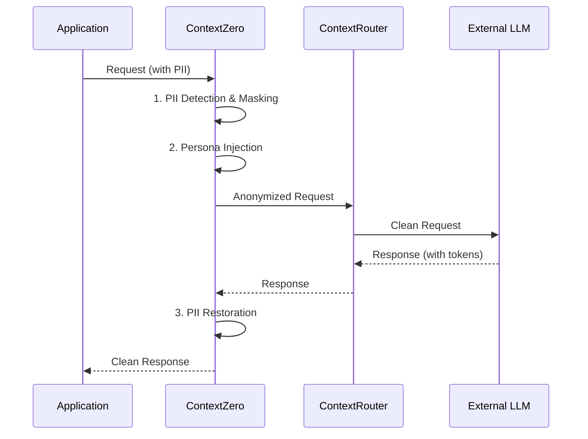

import { Card, CardGrid } from '@astrojs/starlight/components';

:::caution[Enterprise Service]
ContextZero is a commercial service requiring a license. It builds upon the open-source ContextUnity foundation.
:::

ContextZero sits between your application and external LLM providers, ensuring personal data never leaves the trust boundary.

<CardGrid>
  <Card title="PII Anonymization" icon="eye">
    Regex-based entity detection with configurable YAML rules — phones, emails, names, IDs.
  </Card>
  <Card title="Persona Engine" icon="user">
    Template-based system prompt injection for consistent synthetic identities.
  </Card>
  <Card title="Ephemeral Encryption" icon="approve-check">
    AES-256 session keys in RAM only — never persisted, destroyed with the session.
  </Card>
</CardGrid>

## Architecture



## Quick Start

```python
from contextzero import PrivacyMiddleware, ZeroConfig
from contextzero.masking import MaskingConfig, EntityRule

# Define PII detection rules
masking_config = MaskingConfig(
    text_entity_rules=[
        EntityRule(entity_type="phone", prefix="PHN", pattern=r"\+380\d{9}"),
        EntityRule(entity_type="email", prefix="EML", pattern=r"[\w.]+@[\w.]+\.\w+"),
    ]
)

# Create middleware
config = ZeroConfig(enabled=True, persona_enabled=True)
middleware = PrivacyMiddleware.from_config(
    masking_config=masking_config,
    config=config,
)

# Wrap any async LLM call
result = await middleware.process(
    input_text="Call Oleksii at +380501234567",
    llm_call=my_llm_function,
)
# Input to LLM: "Call PHN_a1b2c3 at PHN_d4e5f6"
# Output to user: original names/phones restored
```

## Key Components

### Masking Pipeline (`masking/`)
- **PIIMasker** — text + tabular PII detection and replacement
- **PIIUnmasker** — restore original values from tokens
- **MappingStore** — session-scoped token vault
- **PostMaskScanner** — leak detection after masking
- **EphemeralAES256Backend** — encryption (RAM-only keys)

### ProxyService (`proxy.py`)
Central orchestrator supporting per-call rule merging.

### LangGraph Pipeline (`graph.py`)
8-node privacy pipeline: detect → mask → check → persona → forward → receive → unmask → verify.

## gRPC Service (6 RPCs)

| RPC | Description |
|-----|-------------|
| `Anonymize` | Mask PII in input text |
| `Deanonymize` | Restore original values |
| `ScanPII` | Scan text for PII entities (detection only) |
| `ProcessPrompt` | Full anonymize → LLM → deanonymize pipeline |
| `DestroySession` | Delete session keys from RAM |
| `GetStats` | Privacy metrics |

## Default Rules

Rules are loaded from `masking/rules/defaults.yaml`:

```yaml
rules:
  - entity_type: "name"
    prefix: "PER"
    pattern: "(?i)[А-ЯІЇЄҐ][a-яіїєґ']+\\s+[А-ЯІЇЄҐ][a-яіїєґ']+"
  - entity_type: "phone"
    prefix: "PHN"
    pattern: "\\+380\\d{9}"
  - entity_type: "email"
    prefix: "EML"
    pattern: "[\\w.]+@[\\w.]+\\.\\w+"
```

Consumer projects can extend or override these rules via `MaskingConfig`.
